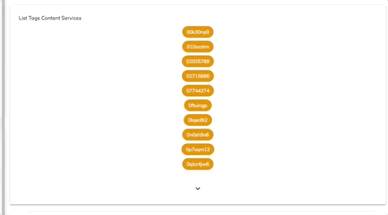

The **Tag List Component** has two new buttons that allow the user to see more/less tags. This turns out to be more useful than showing the whole list of tags related to a node. This functionality is already embedded into the component and the user doesn't have to do anything to make it work.

